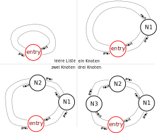

# Hausübung 3 (Abgabe via TUWEL bis 12. Dezember 10:00 Uhr)

In dieser Hausübung (und auch im vorbereitenden/begleitenden Labor) ist es Ihre Aufgabe eine bereitgestellte Implementierung einer doppelt verketteten Liste zu erweitern. Ein Listenknoten (`ListNode`) sieht so aus, wie Sie es von der Vorlesung gewohnt sind:

```c
struct ListNode 
{
  struct ListNode *prev; // pointer to previous node
  struct ListNode *next; // pointer to next node
  T value;               // value 
};
```

Es gibt also (wie gewohnt) neben dem gespeicherten Wert (`value`) jeweils 

- einen Zeiger auf den nächsten Knoten in der Liste (`next`), 
- und einen Zeiger auf den vorherigen Knoten in der Liste (`prev`).

Generell gibt es bei der Implementierung einer Listen-Struktur viele Varianten. Die Implementierung mit der Sie es bei dieser Hausübung (und auch im Labor) zu tun haben finden Sie in `include/List.h` und `src/List.c`. Die Implementierung verwendet einen separat allozierten *Eingangsknoten* (`entry`) der nicht zum Speichern von Werten verwendet wird, sondern einzig als Eingangsknoten, der immer mit dem Anfang und gleichzeitig mit dem Ende der Liste verbunden ist. 

Die Liste selbst hält einzig einen Zeiger auf eben diesen Eingangsknoten: 

```c
struct List
{
  struct ListNode *entry; // cyclic entry node (before first AND after last)
};
```

- `entry->next` zeigt immer auf den ersten Knoten der Liste.
- `entry->prev` zeigt immer auf den letzten Knoten der Liste. 

**Hinweis**: Bei der vorliegenden Implementierung (siehe Bild) kann weder Anfang noch Ende der Liste mit einem Vergleich des Nachfolger/Vorgaengerknotens mit dem `NULL`-Zeiger detektiert werden, sondern:

- Der `next`-Zeiger im letzten Knoten zeigt immer auf `entry`.
- Der `prev`-Zeiger im ersten Knoten zeigt ebenfalls auf `entry`.

- Falls die Liste keine Knoten enthält (also leer ist), zeigen sowohl `entry->next` als auch `entry->prev` auf den Eingangsknoten `entry` selbst (siehe Bild oben links).
- Falls die Liste genau einen Knoten enthält, ist dieser sowohl der erste, als auch der letzte Knoten (siehe Bild oben rechts).
- Der Eingangsknoten `entry` verbindet stets Anfang und Ende einer Liste (siehe Bild unten links und unten rechts), und erzeugt somit einen geschlossenen Kreis.

Die Verwendung eines Eingangsknoten (`entry`) erlaubt eine elegante Implementierung viele Schnittstellen-Funktionen.

Der genaue Implementierungsansatz einer Liste (also das oben beschriebene) hat großen Einfluss auf die Implmentierung der zugehörigen Funktionen. Da Sie in dieser Übung solche Funktionen selbst implementieren sollen ist es unumgänglich, dass Sie sich das Prinzip des Eingangsknotens (wie oben beschrieben) bei der Implementierung stets im Hinterkopf behalten.

Auch bei einer leeren Liste existiert bereits der Eingangsknoten. Ein Blick in die Initialisierungsfunktion `list_new()` gibt Aufschluss, wie der gewünschte Zustand (`entry->next` und `entry->prev` zeigen auf `entry` selbst) herbeigeführt wird:


```c
struct List *list_new()
{
  struct List *res = malloc(sizeof(struct List)); // (1)
  res->entry = malloc(sizeof(struct ListNode)); // (2)
  res->entry->prev = res->entry; // (3a)
  res->entry->next = res->entry; // (3b)
  return res;
}
```

- Zeile (1): Allokation der Liste selbst.
- Zeile (2): Allokation des Eingangsknotens.
- Zeile (3a-b): Herstellung der "Selbstverweise" (leere Liste).




Das Einfügen in eine leere Liste (also der Zustandswechsel des Bildes oben links zu oben rechts) kann z.B. durch ein "Einfügen am Ende" mit der bereitgestellten Funktion `list_push_back` erreicht werden. Ein Einblick in die Implementierung aus `src/List.c` gibt Aufschluss wie das geschieht:

```c
void list_push_back(struct List *self, const T *value)
{
  struct ListNode *node = malloc(sizeof(struct ListNode)); // (1)
  node->value = *value;                 // (2)
  node->prev = self->entry->prev;       // (3a)
  node->next = self->entry;             // (3b)
  self->entry->prev->next = node;       // (4a)
  self->entry->prev = node;             // (4b)
}
```

- Zeile (1): Allokation des Speichers für den neuen Knoten
- Zeile (2): Zuweisung/Kopie des Wertes der gespeichert werden soll
- Zeile (3a-b): Anpassen der Zeiger des neuen Knotens.
- Zeile (4a-b): Anpassen der Zeiger der angrenzenden Knoten.

Unter folgendem Link finden Sie die Beschreibung der bereitgestellten und fertig implementierten Funktionen:

[Bereitgestellte Funktionen zur doppelt verkettete Liste](LIST.md)

Unter folgendem Link finden Sie die Aufgabenstellung der Hausübung:

[Aufgabenstellung Hausübung](HOMEWORK.md)

Unter folgendem Link finden Sie die Aufgabenstellung für das Labor 3:

[Aufgabenstellung Labor](labtask/README.md)
